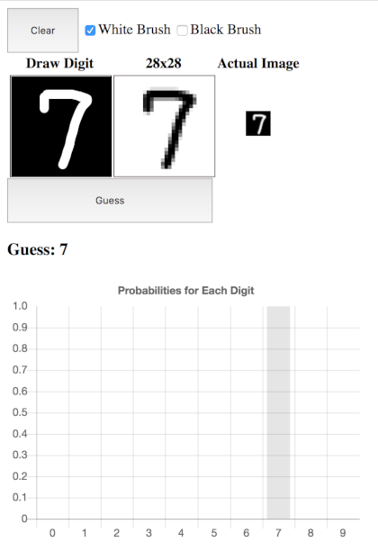

# Tensorflow.js based Javascript UI to predict hand-written digits
This is a simple JavaScript UI based app that downloads the Python based Keras trained model to predict the hand-drawn digit. This was converted from a "quick and dirty" learning project that leveraged flask python web server that accepted drawing from a browser and returned a guess with percentages.

To run from your local dev machine, get the code, and do below to launch a web server at localhost:3000
```bash
npm install
npm start
```

Use any HTML5 capable browser ( anything other than IE) to go to http://localhost:3000 to view the UI below.

I've deployed this to a Heroku URL:
https://sspak9-ml.herokuapp.com/


Draw with a white brush and erase with a black brush. When done, click Guess to predict the digit and show the percentage assigned for various digits the Kera ML trained model predicted.



### How the model was trained
The model was trained offline using python based tensorflow/keras framework against MNIST data.  The model selected leverages convolutional network that gave about 99.61% against the "test" data that were not used for training

The actual python code used to train the model is shown below. I captured the snapshot of the model at the end of each epoch. I picked the one with the highest validation accuracy and converted that into tensorflow.js format using the command:

```bash
tensorflowjs_converter --input_format keras \
                       path/to/my_model.h5 \
                       path/to/tfjs_target_dir
```
The two files generated were copied to /public/model folder

### How index.html "enables" the tensorflow.js

I download the tensorflow.js library first in the index.html file
```html
<head>
<meta charset="utf-8"/>
<script type="text/javascript" src="https://cdnjs.cloudflare.com/ajax/libs/tensorflow/0.15.2/tf.min.js"></script>
</head>
```
Then the JavaScript on the same page downloads the model:
```javascript
// load model
var model;

mp = tf.loadLayersModel('/model/model.json');
mp.then( function(value) {
  model = value;
})
```
BTW, I haven't figured out the Promise yet correctly, so please execuse any blunder in using it.

When the Guess button is clicked, the drawn digit on the left canvas is down-sampled to 28x28 gray image and is shown on the right.

Then the gray image that is of 28x28 size (784) is converted to float array of value between 0 to 1.0 and then submitted to the model to predict

```javascript
// convert to 4D tensor
  let t4d = tf.tensor4d( fa , [1 , 28, 28, 1]);
  
  // predict
  let rp = model.predict(t4d)
```
The rest of the code is used to extract the data from the Promise and display on the UI.

### Please view other Jupyter Notebooks saved here. Some samples are below

[View Jupyter Notebook on simple ANN model](Keras_ANN.ipynb)

[View Jupyter Notebook on sample cnn model](mac_plaid.ipynb)

[View Jupyter Notebook on using data augmentation to enhance the cnn model](CNN_augmentation.ipynb)

[View Jupyter Notebook on couple of gotchas when using keras/tensorflow](Misc_tensorlfow_keras_info.ipynb)
